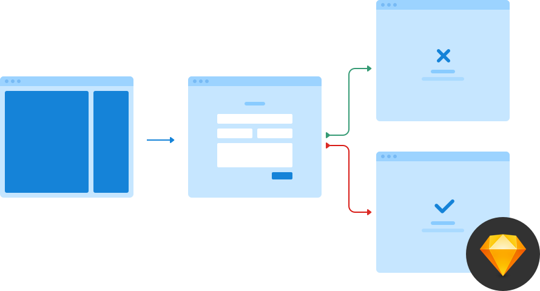

# Flowchart Cards

Depict the flow of movement for your next web app using Flowchart Cards.
  

Flowchart Cards, built in Sketch, utilises Symbols to help build complex UX flows in a jiffy.

Flowchart Cards comes with 45 cards representing a variety of layouts, components, pages and verification states. The movement between cards can be demonstrated with connectors of which their are currently 14 across 4 styles.

## Features

- 45 cards
- 14 connector types across 4 styles
- Organised shared styles and text styles
- Each card exported as a .png with/without labels

## Carefully Crafted
Flowchart Cards come with 45 cards. Each one meticulously crafted with just enough detail to get your flow across without encouraging too much conversation around the layout/design.

## What's in the pipeline?

- More layouts, components and pages
- Templates for easier composition and printing
- More connector types

## Feedback & Suggestions

Together, we can make Flowchart Cards even better! Please get in touch with your feedback and suggestions.
  
Email: me@createdbynick.com or find me on Twitter [@createdbynick](https://twitter.com/createdbynick)
